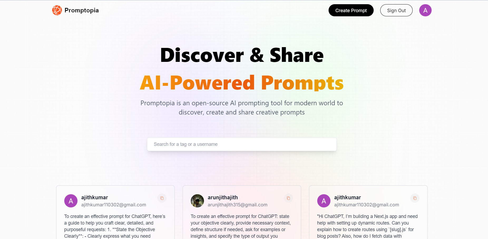

# Promptopia



**Promptopia** is a platform where users can create, read, update, and delete prompts for AI. Whether you're brainstorming new ideas or sharing interesting prompts, Promptopia is the perfect place for AI enthusiasts to interact and collaborate.


## Getting Started

To run Promptopia on your local machine, follow these steps:

## Clone the repository:

git clone https://github.com/Moyo-Made/Promptopia.git

cd promptopia

## Run the development server:

```bash
npm run dev
# or
yarn dev
# or
pnpm dev
# or
bun dev
```

Open [http://localhost:3000](http://localhost:3000) with your browser to see the result.

## Live Demo

Check out the live version of Promptopia here. https://promptopia-peach-one.vercel.app/

You can start editing the page by modifying `app/page.js`. The page auto-updates as you edit the file.

This project uses [`next/font`](https://nextjs.org/docs/basic-features/font-optimization) to automatically optimize and load Inter, a custom Google Font.

## Learn More

To learn more about Next.js, take a look at the following resources:

- [Next.js Documentation](https://nextjs.org/docs) - learn about Next.js features and API.
- [Learn Next.js](https://nextjs.org/learn) - an interactive Next.js tutorial.

You can check out [the Next.js GitHub repository](https://github.com/vercel/next.js/) - your feedback and contributions are welcome!

## Deploy on Vercel

The easiest way to deploy your Next.js app is to use the [Vercel Platform](https://vercel.com/new?utm_medium=default-template&filter=next.js&utm_source=create-next-app&utm_campaign=create-next-app-readme) from the creators of Next.js.

Check out our [Next.js deployment documentation](https://nextjs.org/docs/deployment) for more details.
